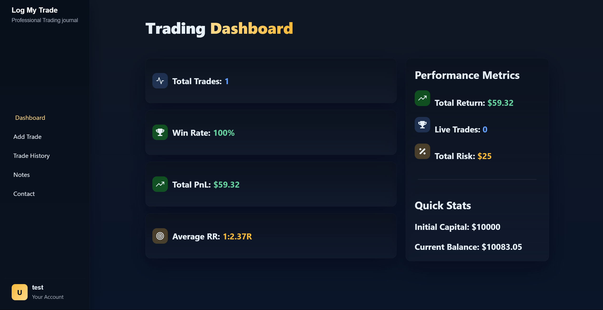
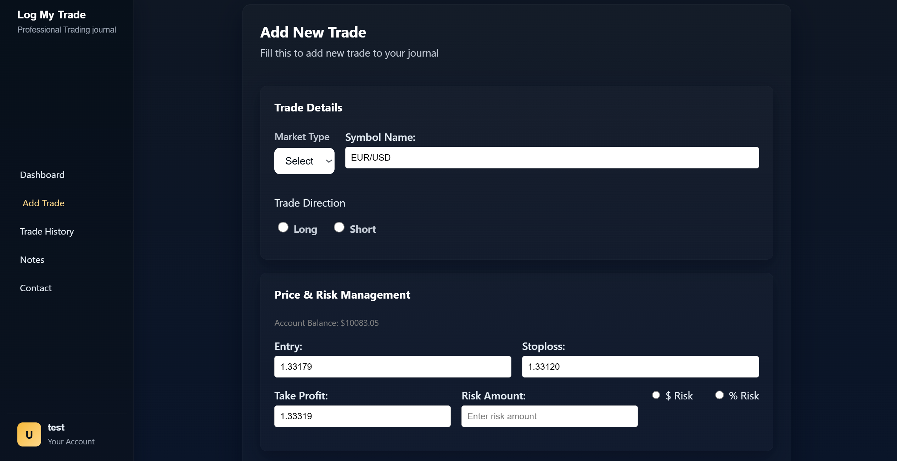
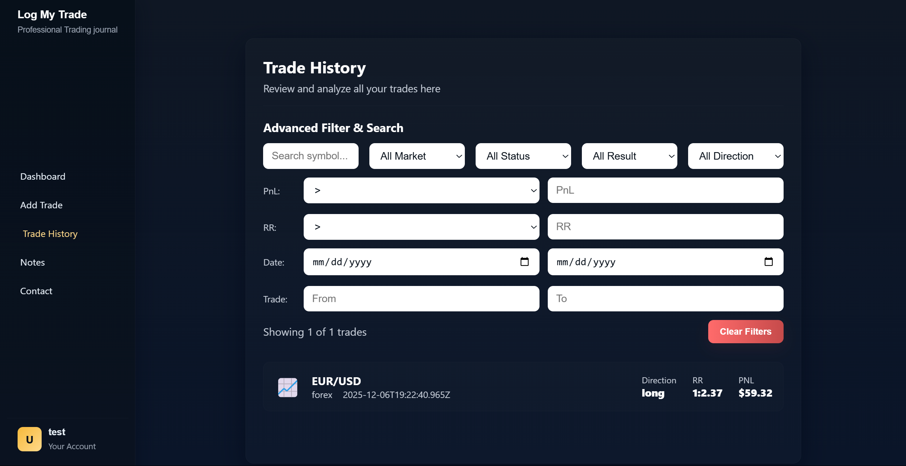
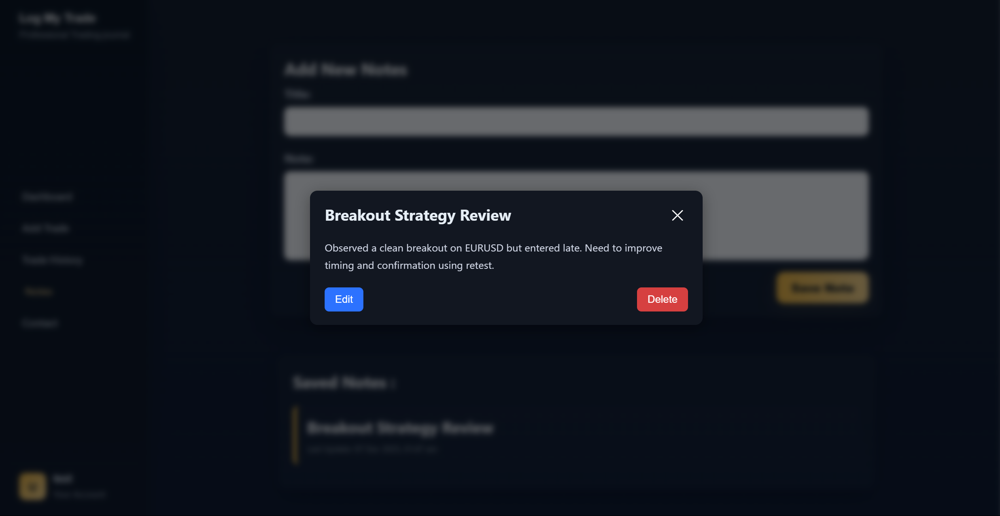
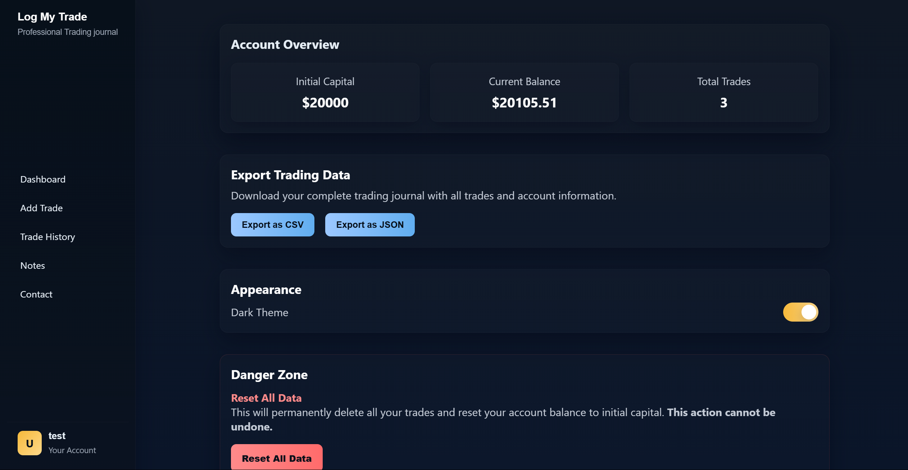
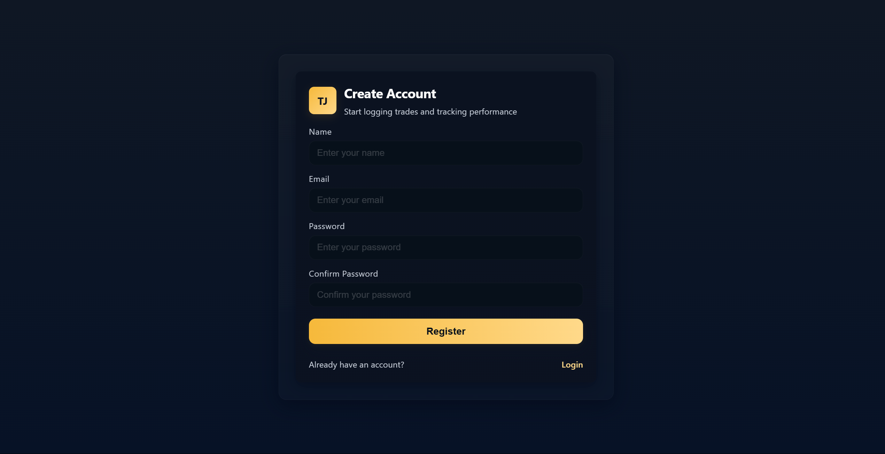

# Trading Journal SaaS (MERN Stack)
A full-stack Trading Journal SaaS built with the MERN stack (MongoDB, Express.js, React, Node.js). This application allows traders to log trades, track PnL, manage multiple accounts, and analyze performance over time.

## Live Demo
**Live URL:** https://trading-journal-saas.netlify.app/

## Screenshots

### Dashboard

### Homepage

### Add Trade

### Trade History (with Filters)

### Trade Details Page

### Notes Modal

### Account Page

### Register Page

## Features
### Trading
- Add, edit, delete trades
- Track entry/exit, SL/TP, lot size, symbol, tags, notes
- Auto PnL and R:R calculation
- Search, filter, sort trades
### Multi-Account
- Create and manage multiple accounts
- Separate PnL per account
- Switch active accounts
### Analytics
- Win rate, accuracy, average profit/loss
- Best/worst trades
- Net PnL overview
### Authentication
- JWT-based auth
- Password hashing (bcrypt)
- Protected routes

## Tech Stack
**Frontend:** React, Context API, Axios, Vite  
**Backend:** Node.js, Express.js, Mongoose  
**Database:** MongoDB  
**Auth:** JWT + bcrypt  

