

# 📈 Kyros Journal

### Professional Trading Journal built for serious traders.

Track every trade • Discover your edge • Improve your execution

 

 

**A full-stack SaaS platform that helps traders journal, analyze, and improve their trading performance through data-driven insights.**

[🌐 Live Demo](https://kyrosjournal.dev) • [📄 Documentation](#features)

---

# ✨ Overview

Most trading journals simply record trades.

**Kyros Journal** goes beyond journaling by helping traders:

- 📊 Analyze performance with advanced analytics
- 📈 Discover statistical trading edges
- 🧠 Improve execution through trade reviews
- 🎯 Compare strategies and setups
- 💼 Manage multiple trading accounts
- 🔄 Replay trades using historical market data
- 👨‍💼 Manage users through an admin dashboard

---

# 🚀 Live Demo

### 🌐 Website

https://kyrosjournal.dev

### 🧪 Demo Account

| Email | Password |
|--------|----------|
| **import@gmail.com** | **import** |

---

# 📸 Screenshots

## 🏠 Landing Page

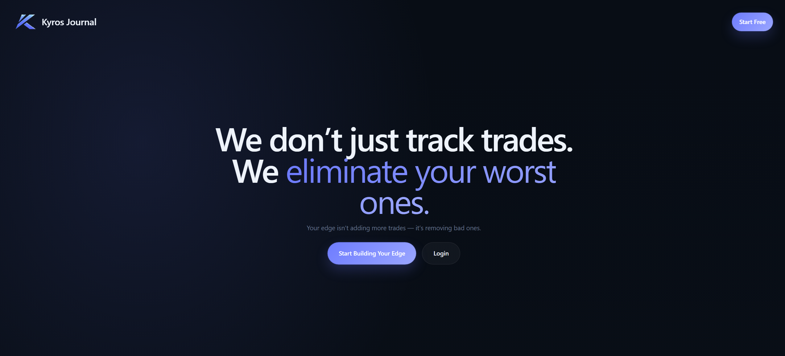

---

## 📊 Dashboard

---

## ➕ Add Trade

---

## 📜 Trade History

*Advanced filtering, sorting, and trade preview.*

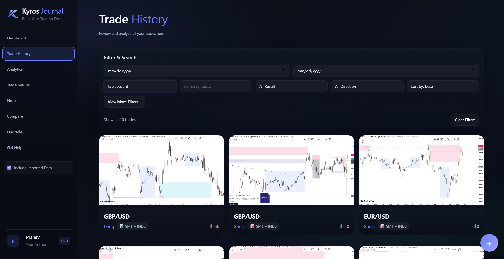

---

## 📈 Trade Details

*Chart replay, screenshots, notes, and trade management.*

---

## 📞 Contact

---

## 👤 Account Management

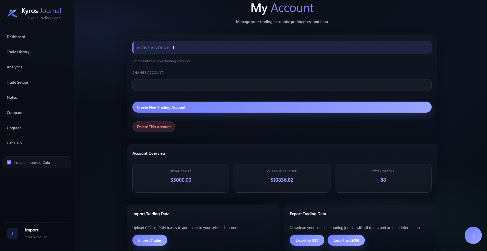

---

## ⚙️ Trade Setups

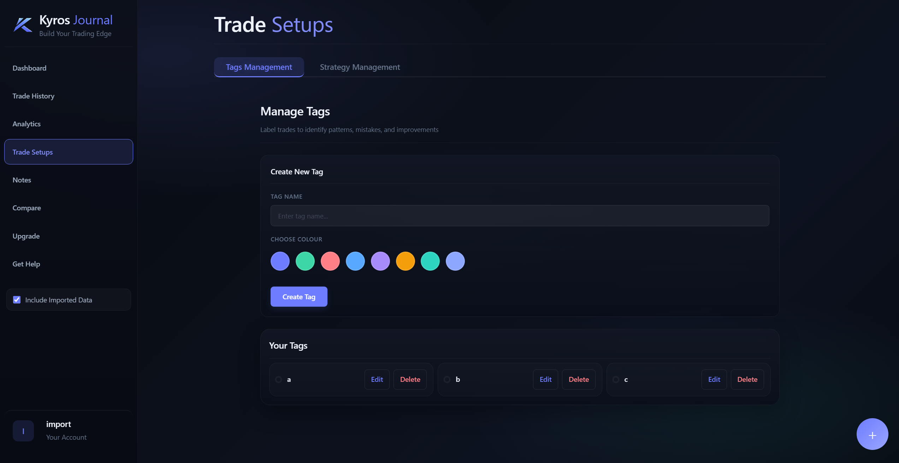

---

## 💎 Upgrade

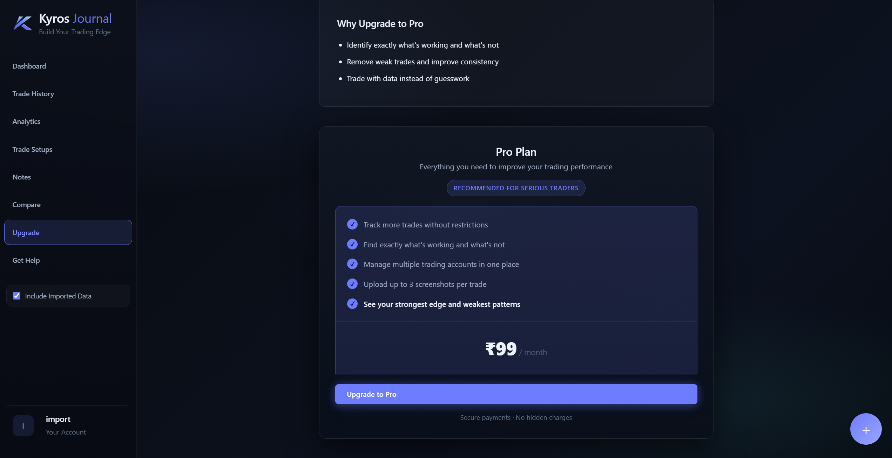

---

## ⚖️ Compare Trades

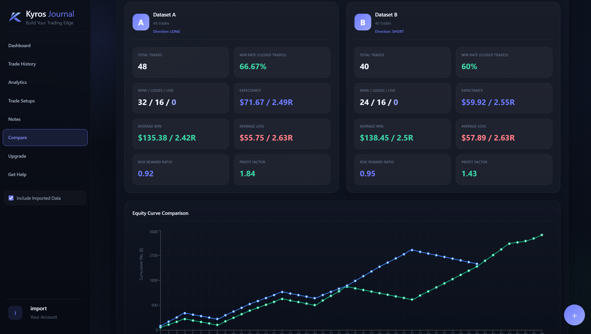

---

## 📝 Notes

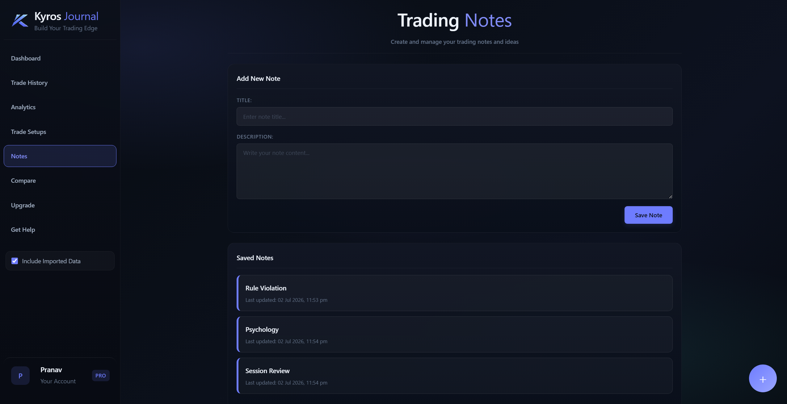

---

## 📊 Analytics Dashboard

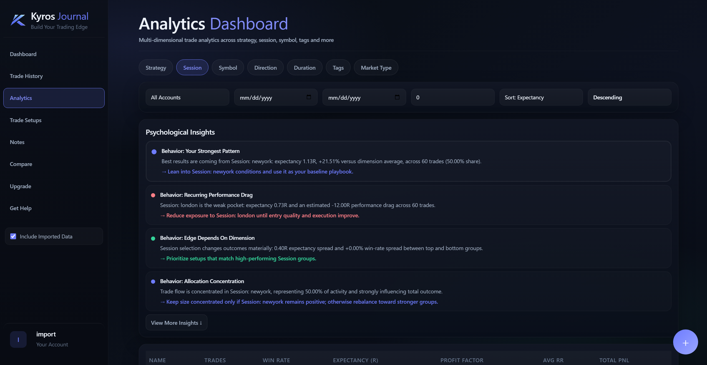

---

## 👨‍💼 Admin Dashboard

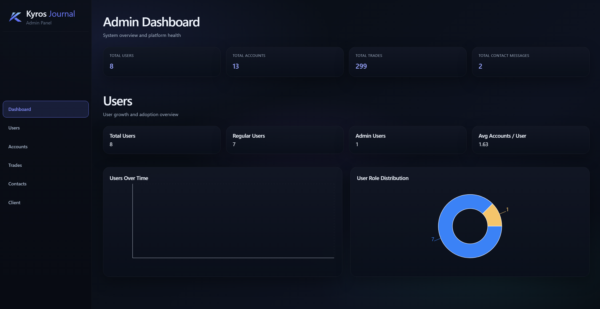

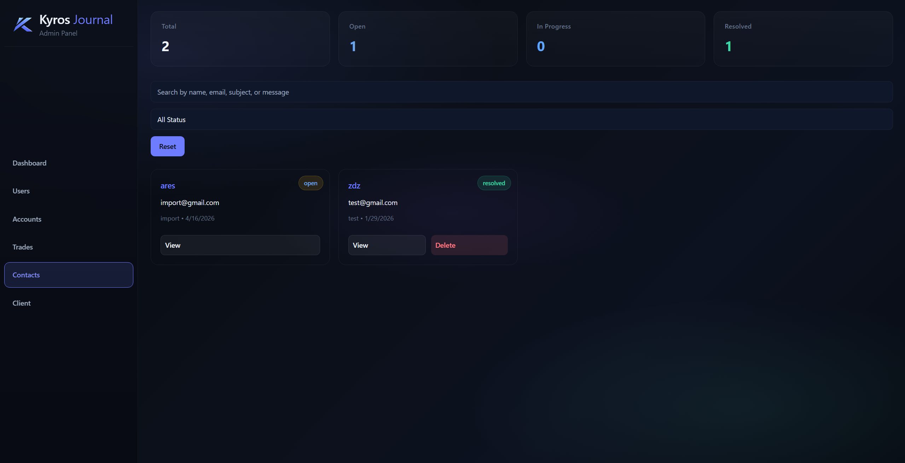

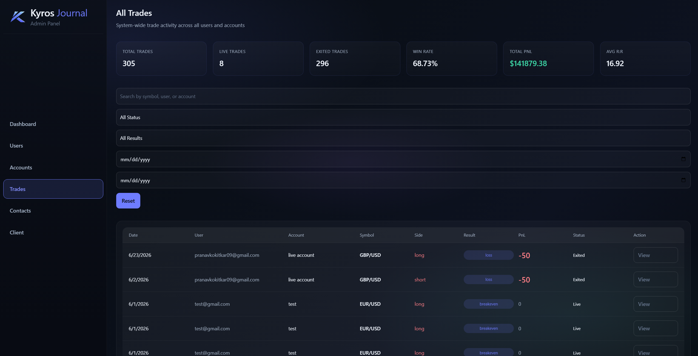

---

## 📱 Mobile Responsive

| Home | Dashboard |
|------|-----------|
| 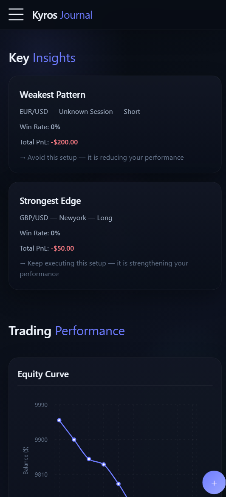 | 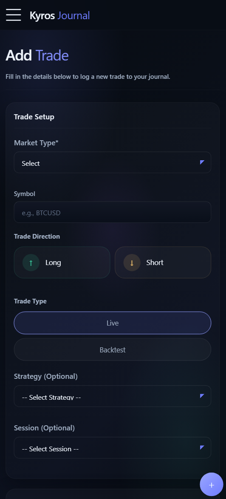 |

---

# ✨ Features

## 📈 Trading Journal

- Record Live & Backtest Trades
- Multi-Exit Position Support
- Position Size & Risk Calculator
- Screenshot Uploads
- Trade Notes
- Entry & Exit Planning
- Trade Confidence Rating
- Pre-Trade Checklist
- Session Tracking
- Market Type Classification

### 📊 Analytics

- Win Rate
- Profit Factor
- Expectancy
- Session Performance
- Strategy Analytics
- Symbol Analytics
- Direction Analysis
- Duration Analysis
- Drawdown Analysis
- Equity Curve

### 🔍 Trade Review

- Interactive Chart Replay
- Historical Market Data
- Screenshot Gallery
- Edit Trades
- Close Live Trades
- Restore Deleted Trades
- Undo Actions

### 💼 Account Management

- Multiple Trading Accounts
- Active Account Switching
- Account Performance Tracking
- Import & Export Trades
- Automatic Balance Recalculation

### 🏷️ Organization

- Custom Tags
- Strategy Management
- Powerful Filters
- Trade Search
- Notes Management

### 🔐 Authentication & Security

- JWT Authentication
- Protected Routes
- Role-Based Access Control
- Password Hashing
- Request Validation
- Rate Limiting

### 💳 Subscription System

- Razorpay Integration
- Free & Pro Plans
- Feature Gating
- Plan Expiration Handling

### 👨‍💼 Admin Panel

- User Management
- Account Management
- Trade Management
- Contact Ticket Management
- Dashboard Analytics
